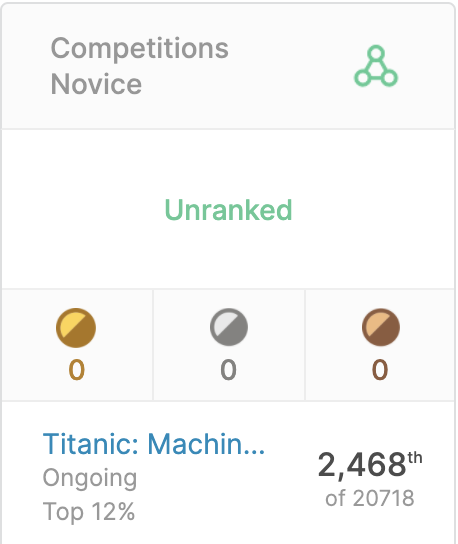
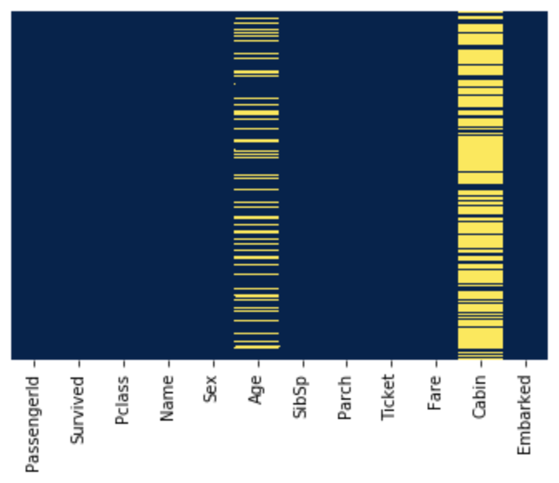
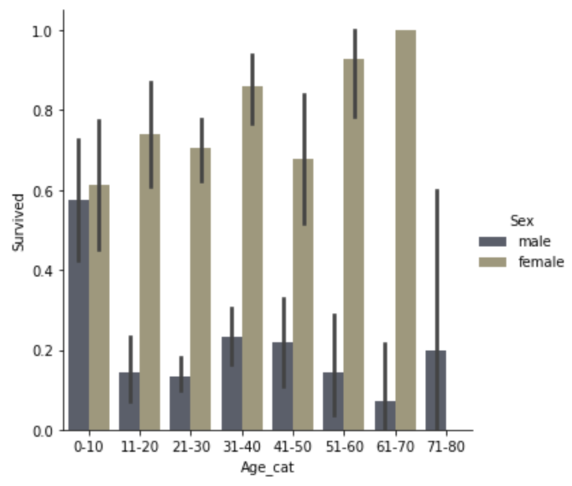
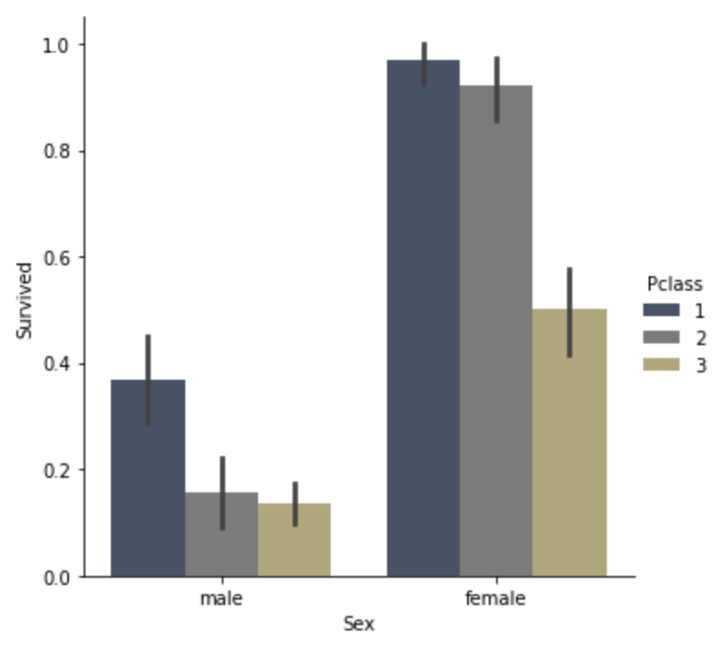
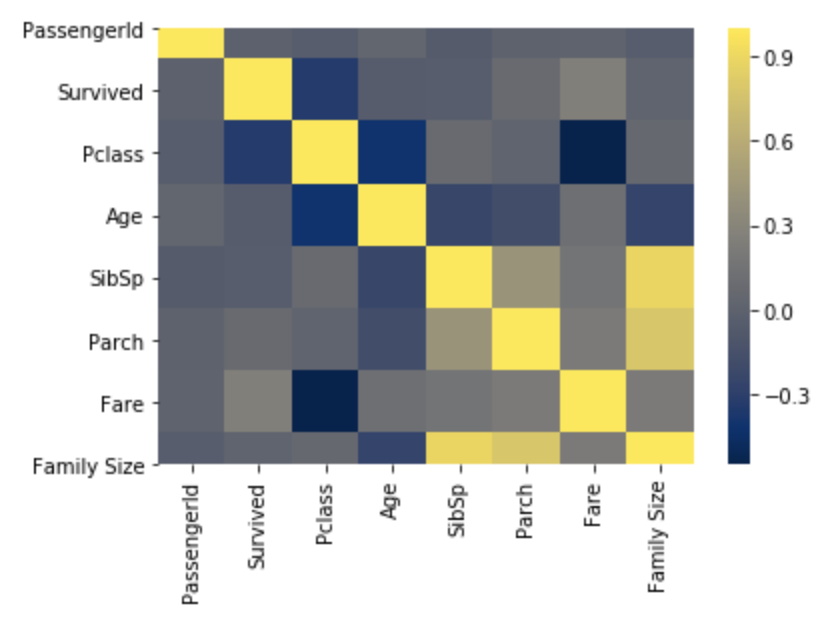

Titanic project - Kaggle
=======

Motivations
-------

As a data lover for a few years now, I long waited for the moment when I would be able to tackle the famous Titanic project!

I took the leap, learned more about Data Science and Machine Learning and eventually worked on this project.

Sources
-------

I used Kaggle's Titanic dataset.

*https://www.kaggle.com/c/titanic/data*

The code
-------

Click [here](https://github.com/SalimAmarti/Titanic_Project/blob/master/Titanic%20model.ipynb) to view the code.

Executive Summary
-------

As it is my first project, I took an extensive time exploring the data. Then I went through the features during EDA to find helpful insights for the next steps of the analysis.
I spent some time cleaning the data and tried several Machine Learning models to best predict the survivors.

The best model was **Gradient Boosting** as the prediction reached an accuracy of **0.78947**.

I was able to reach the **top 12%** of the Kaggle leaderboard!

Exploratory Data Analysis (EDA)
-------

| Variable | Definition | Key |
| --- | --- | --- |
| survival | Survival | 0 = No, 1 = Yes |
| pclass | Ticket class	| 1 = 1st, 2 = 2nd, 3 = 3rd |
| sex | Sex |	
| Age |	Age in years |	
| sibsp | # of siblings / spouses aboard the Titanic |
| parch | # of parents / children aboard the Titanic |	
| ticket | Ticket number |	
| fare | Passenger fare	|
| cabin | Cabin number |	
| embarked | Port of Embarkation | C = Cherbourg, Q = Queenstown, S = Southampton |

I looked at the distributions for the various numerical and categorical variables. Below are a few highlights of the interesting insights:

   

For more details, feel free to go through [the code](https://github.com/SalimAmarti/Titanic_Project/blob/master/Titanic%20model.ipynb).

Data cleaning
-------

- Removed 'Cabin' as it has more than 75% of null values
- Fill null values in the 'Age' feature using the mean age per class
- Removed 'PassengerId' which I didn't think would be of any use
- Removed 'Name' even if I believe it would be interesting to perform some NLP here
- Performed one-hot encoding for 'Sex' as models need to be fed with numerical features
- Created 'Family Size' and removed 'SibSp' and 'Parch'
- Removed 'Ticket' even if we could maybe do something with that feature
- Performed one-hot encoding for 'Embarked'

Model Building
-------

First, I created dummy variables to transform categorical variables into numerical ones. Then, I split the data into train and test sets (70%-30%) in order to try several models before submitting them on Kaggle.

I decided to use confusion matrices and classification reports to evaluate the models. It allowed me to evaluate the performance based on accuracy, precision, recall and f1-score.

I tried several models well-suited for classification problems:
- **Multiple Linear Regression**
- **Logistic Regression**
- **Decision Tree** 
- **Random Forest**
- **Gradient Boosting**

Model Performance
-------

The **Gradient Boosting** model outperformed the other models by far on Kaggle.

| Model | Kaggle Accuracy |
| --- | --- |
| Multiple Linear Regression |0.75598|
| Logistic Regression |0.76555|
| Decision Tree |0.73684|
| Random Forest |0.75598|
| Gradient Boosting |0.78947|

Next steps / Improvements
-------

- Use the 'Name' feature and extract the titles of the passengers (Mr, Mrs, Master...)
- Use the 'Ticket' feature and check if it could be relevant
- Try other Machine Learning models (SVM, Naive Bayes, K-Nearest Neighbors, XGBoost...)
