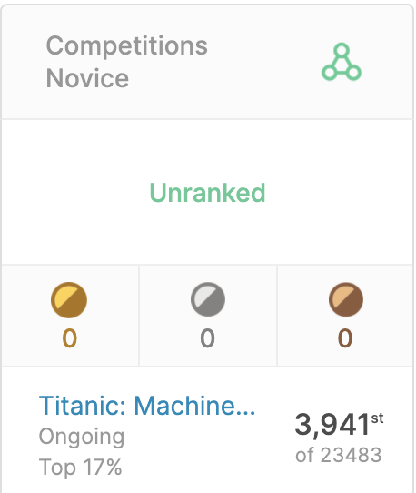

Titanic project - Kaggle
=======

Motivations
-------

As a data lover for a few years now, I long waited for the moment when I would be able to tackle the famous Titanic project!

I took the leap, learned more about Data Science and Machine Learning and eventually worked on this project.

Sources
-------

I used Kaggle's Titanic dataset.

https://www.kaggle.com/c/titanic/data

Executive Summary
-------

As it is my first project, I took an extensive time exploring the data. Then I went through the features during EDA to find helpful insights for the next steps of the analysis.
I spent some time cleaning the data and tried several Machine Learning models to best predict the survivors.

The best model was **Gradient Boosting** as I reached a score of **0.78947**.

I was able to reach the **top 17%** of the Kaggle leaderboard!

Exploratory Data Analysis (EDA)
-------

Model Building
-------

Next steps / Improvements
-------
